# Построение виртуальных карт зданий

Веб-приложение для построения 3D-моделей этажей зданий на основе планов эвакуации: загрузка и обработка изображений плана, построение векторной модели, генерация 3D, навигация, редактирование планов и сборка отсеков и этажей в здание (stitching).

## Запуск проекта

Полная инструкция для Windows (установка PostgreSQL, миграции, создание администратора, решение типовых проблем) — в [SETUP.md](SETUP.md). Кратко:

### Backend

```powershell
cd backend
python -m venv venv
.\venv\Scripts\activate
pip install -r requirements.txt
copy .env.example .env          # затем укажите DATABASE_URL (PostgreSQL)
alembic upgrade head            # создание таблиц
python create_admin.py          # администратор по умолчанию: admin / admin
uvicorn main:app --reload
```

Бэкенд поднимется на `http://127.0.0.1:8000`.

### Frontend

```powershell
cd frontend
npm install                     # при первом запуске
npm run dev
```

### Проверка и сборка

```powershell
cd backend
pytest

cd frontend
npm run build
npm run lint
```

## Технологии

### Backend
- Python 3.12
- FastAPI + Uvicorn
- SQLAlchemy 2 (async) + Alembic
- Pydantic
- OpenCV, NumPy, SciPy, scikit-image, Pillow
- pytesseract (OCR)
- shapely, trimesh (геометрия и генерация 3D)
- NetworkX (навигационный граф)
- JWT (python-jose) + bcrypt (passlib)

### Frontend
- React 18 + TypeScript
- Vite
- React Router
- Axios
- Three.js + @react-three/fiber + @react-three/drei
- Fabric.js
- Zustand
- lucide-react (иконки)
- ESLint, Vitest

### База данных
- PostgreSQL (asyncpg) — основная БД, настройка в [SETUP.md](SETUP.md)
- SQLite (опционально для локальной разработки; требует `pip install aiosqlite`)

## Архитектура

### Backend

- `api/` — HTTP-роутеры;
- `services/` — бизнес-логика и оркестрация;
- `processing/` — обработка изображений, 3D, навигация, stitching;
- `db/` — ORM-модели и репозитории;
- `models/` — Pydantic API/domain модели;
- `core/` — конфигурация, БД, безопасность, логирование.

### Frontend

- `pages/` — пользовательские сценарии;
- `components/` — UI-компоненты;
- `hooks/` — вся логика и состояние;
- `types/` — TypeScript типы;
- `api/` — HTTP-клиент.

## Основные сценарии

1. Пользователь загружает план эвакуации.
2. Backend обрабатывает изображение и строит векторную маску.
3. Система генерирует 3D-модель и даёт её просмотреть в браузере.
4. Пользователь может редактировать план и повторно строить навигационные данные.
5. Пользователь может объединять несколько планов через stitching.
6. Пользователь строит маршрут между помещениями.

## Полезные ссылки

- API docs: `http://localhost:8000/api/docs`
- ReDoc: `http://localhost:8000/api/redoc`
- Healthcheck: `http://localhost:8000/health`

## Демонстрация реализации

Ниже показаны основные экраны системы в порядке типового пользовательского сценария — от поиска здания до построения межэтажного маршрута в готовой 3D-модели.

### 1. Стартовый экран поиска здания

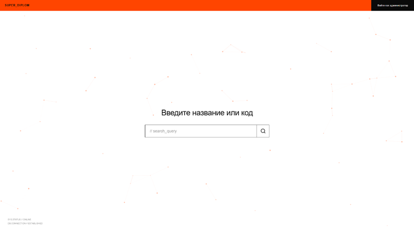

Главная страница для конечного пользователя. По центру — поле «Введите название или код», в котором можно найти нужное здание по названию или коду. В правом верхнем углу — вход для администратора.

### 2. Поиск с подсказками

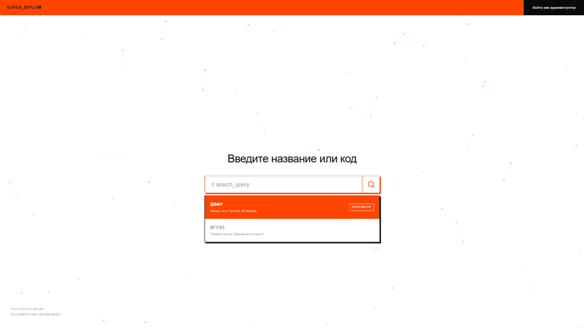

При вводе запроса система подсказывает подходящие объекты (например, «ДВФУ — Кампус на о. Русский» и «ВГУЭС — Главный корпус»). Кнопка «Просмотр» открывает выбранное здание.

### 3. Вход в систему

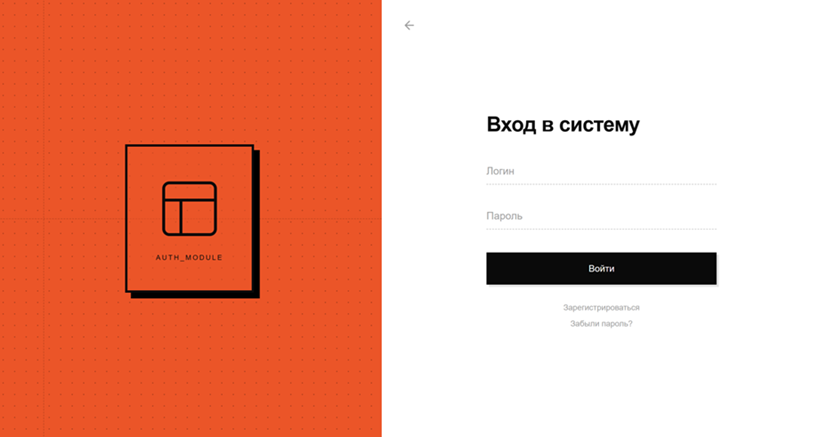

Форма авторизации администратора: логин и пароль, ссылки на регистрацию и восстановление доступа. После входа открывается панель управления зданиями.

### 4. Управление корпусами и этажами

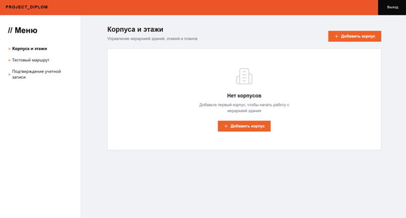

Административная панель с иерархией «корпус → этаж → план». Здесь администратор создаёт корпуса, добавляет этажи и переходит к загрузке планов. Слева — навигация по разделам.

### 5. Загрузка планов эвакуации

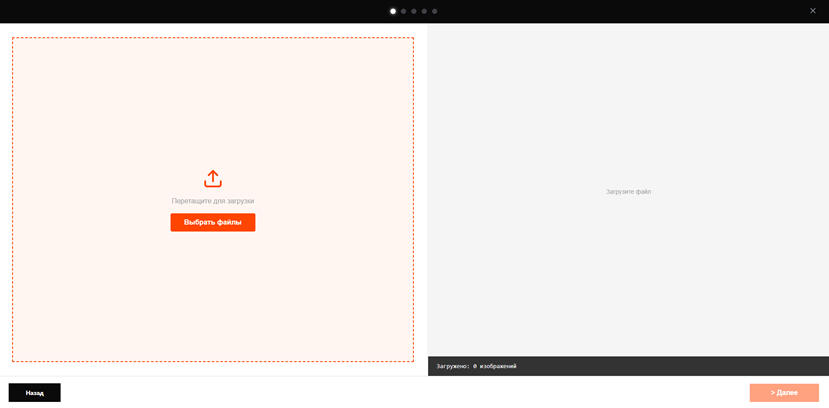

Мастер реконструкции, первый шаг: загрузка изображений плана перетаскиванием или через выбор файлов. Поддерживается загрузка нескольких изображений.

### 6. Редактор стен и разметка объектов

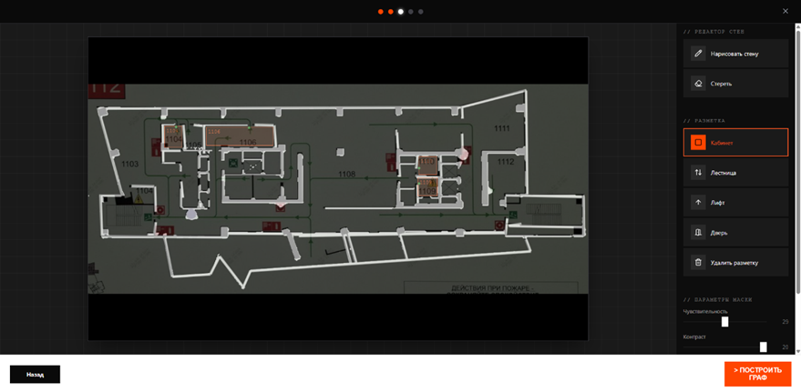

На обработанном плане можно дорисовывать и стирать стены, а также размечать объекты: кабинеты, лестницы, лифты и двери. Ползунки чувствительности и контраста управляют бинаризацией изображения. Кнопка «Построить граф» запускает построение навигационной сети.

### 7. Навигационный граф

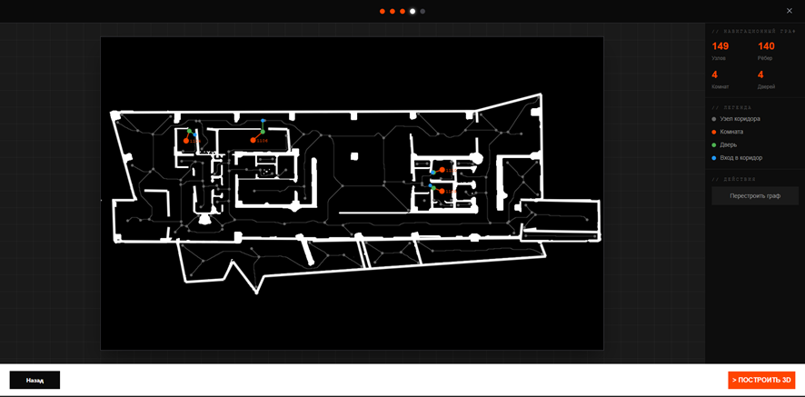

Поверх векторной маски плана строится навигационный граф: узлы коридоров, комнаты, двери и входы в коридор. Справа — статистика (число узлов, рёбер, комнат и дверей) и возможность перестроить граф перед генерацией 3D.

### 8. 3D-модель этажа и маршрут

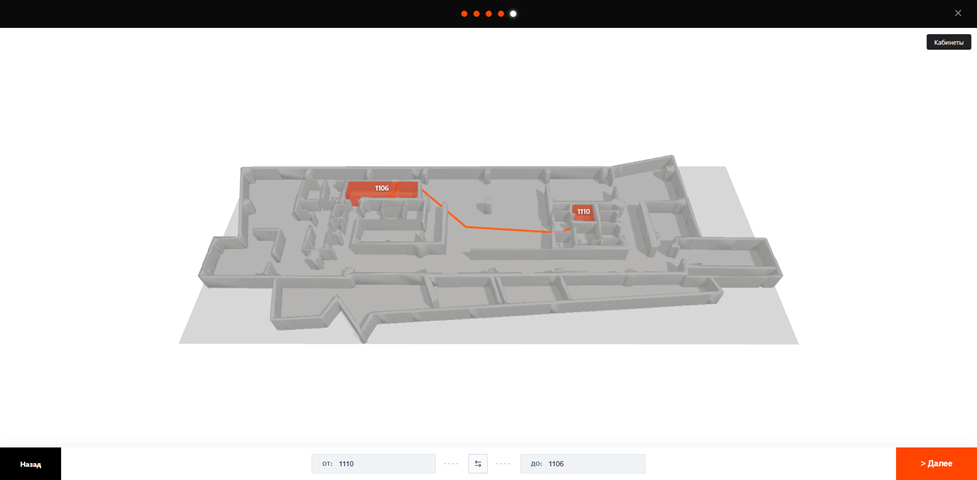

Сгенерированная 3D-модель этажа. Пользователь выбирает кабинеты «от» и «до», и система прокладывает между ними маршрут (выделен оранжевым) прямо по объёмной модели.

### 9. Загрузка плана отсека

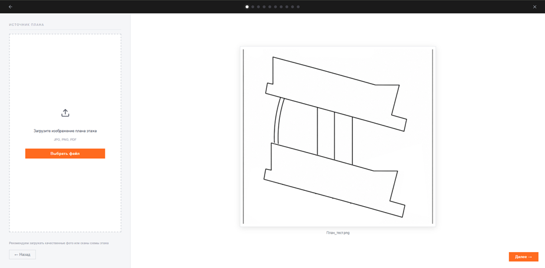

Сборка этажа из нескольких частей (отсеков). На этом шаге загружается изображение плана отдельного отсека (JPG, PNG, PDF) с предпросмотром.

### 10. Разметка отсеков

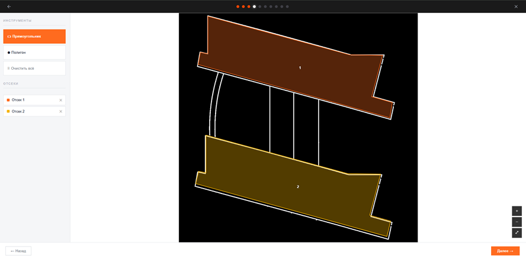

Инструментами «прямоугольник» и «полигон» на плане выделяются отдельные отсеки этажа (Отсек 1, Отсек 2 и т.д.), каждый своим цветом.

### 11. Привязка планов к отсекам

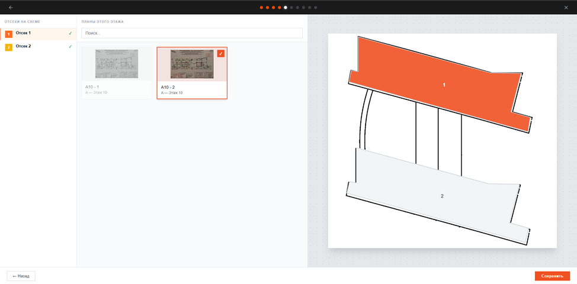

Каждому отсеку на схеме назначается соответствующий план этажа из списка доступных. Справа отображается, какой план привязан к какому отсеку.

### 12. Горизонтальная сшивка отсеков

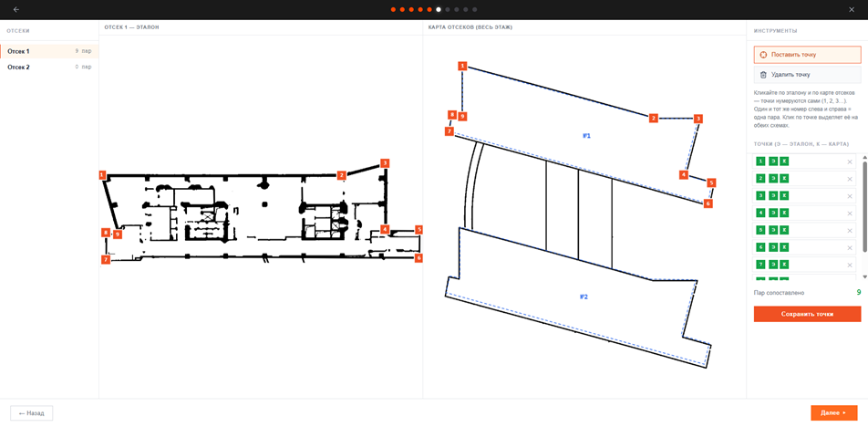

Двухпанельный экран совмещения отсеков: на эталоне и на общей карте этажа расставляются парные контрольные точки с одинаковыми номерами. По ним вычисляется преобразование, которое стыкует отсеки в единый план этажа.

### 13. Переходы и вырезы между отсеками

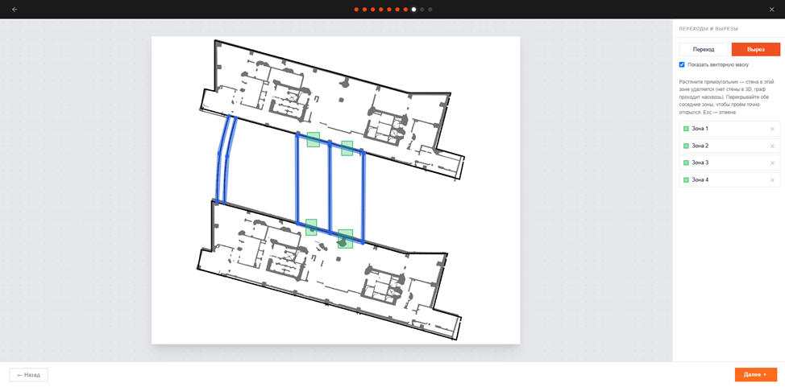

На стыках отсеков размечаются переходы (синие зоны) и вырезы в стенах (зелёные проёмы), чтобы навигационный граф непрерывно проходил между частями этажа.

### 14. Собранный этаж в 3D с навигацией

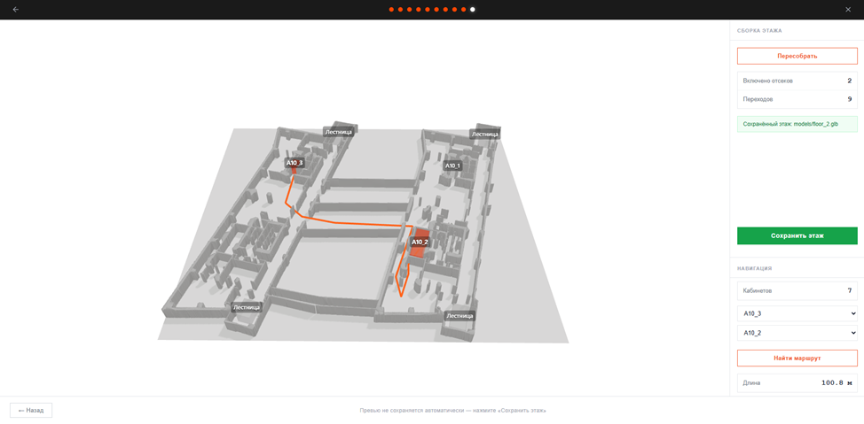

Готовая 3D-модель целого этажа, собранного из отсеков, с отмеченными лестницами. В панели навигации задаётся маршрут между кабинетами; система показывает путь (оранжевый) и его длину.

### 15. Вертикальная стыковка этажей

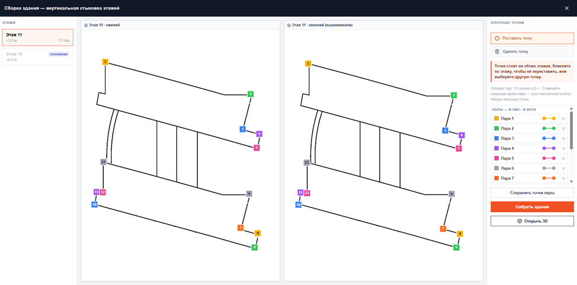

Сборка здания по высоте: нижний и верхний этажи выравниваются друг относительно друга парными опорными точками (углы лестничных клеток, несущие стены). После сопоставления этажи собираются в единую модель здания.

### 16. 3D-модель здания и межэтажный маршрут

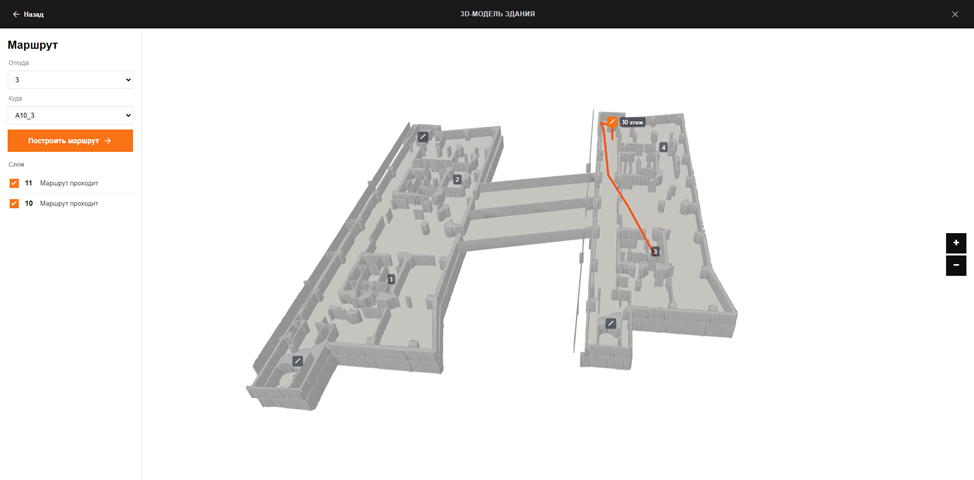

Итоговая многоэтажная модель здания. Маршрут прокладывается между помещениями на разных этажах и проходит через лестницы и лифты; видимостью отдельных этажей можно управлять через слои.
